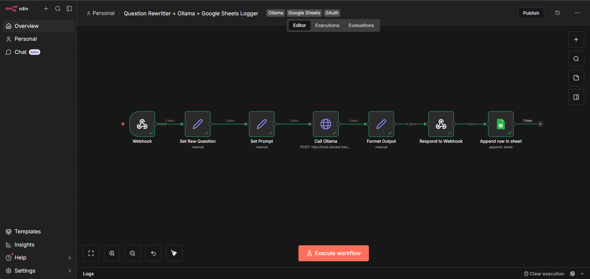

# Question Rewriter + Google Sheets Logger

## Overview

This n8n workflow accepts a question through a webhook, rewrites it into a clearer AI prompt, sends it to a local Ollama model, returns the generated response, and logs the full interaction into Google Sheets.

This project demonstrates a complete input -> transformation -> AI call -> response -> logging pipeline.

## What It Does

- Receives a question through a webhook
- Extracts the question from the request body
- Rewrites the question into a more structured prompt
- Sends the prompt to Ollama using an HTTP request
- Returns the final answer through the webhook response
- Appends the interaction to Google Sheets

## Tools Used

- n8n
- Webhook node
- Set / Edit Fields node
- HTTP Request node
- Respond to Webhook node
- Google Sheets node
- Ollama (local AI model)

## Workflow Architecture

```text
Webhook -> Set Raw Question -> Set Prompt -> Call Ollama -> Format Output -> Respond to Webhook -> Google Sheets
```

## Input Format

The webhook expects a JSON body like this:

```json
{
  "question": "How do I study with better focus for 2 hours?"
}
```

## Output Format

The workflow returns a JSON response containing:

- `raw_question`
- `rewritten_prompt`
- `final_answer`

Example response:

```json
{
  "raw_question": "How do I study with better focus for 2 hours?",
  "rewritten_prompt": "Rewrite and answer the user's question clearly, with practical steps. Keep it concise and actionable. User question: How do I study with better focus for 2 hours?",
  "final_answer": "Start with a distraction-free setup, break the 2-hour block into shorter focus intervals, and define one clear study target before beginning."
}
```

## Google Sheets Logging

Each successful request is logged to Google Sheets with these columns:

- `timestamp`
- `raw_question`
- `rewritten_prompt`
- `final_answer`

This creates a simple history of interactions for review and future improvement.

## Why This Project Matters

This workflow shows practical automation skills, not just a toy AI response.

It demonstrates:

- API-based workflow building
- Clean data transformation between nodes
- Webhook request handling
- Response control
- Logging as a side effect after returning the response

This same pattern can be adapted for:

- Lead capture tools
- Internal business assistants
- Support intake workflows
- Logging and audit pipelines

## Screenshots

### Workflow Overview


Additional proof images are available in the `screenshots` folder:
- `webhook-output.png`
- `google-sheets-log.png`

## Key Lessons Learned

- A webhook must receive the correct JSON body or downstream nodes fail
- Docker networking can require `host.docker.internal` instead of `localhost`
- API requests are strict about data types (for example, boolean vs string)
- It is better to separate response handling from logging
- Clean node-by-node design makes debugging much easier

## Files in This Folder

- `workflow.json` - exported n8n workflow
- `README.md` - project documentation
- `screenshots/` - proof-of-work images

## Security Note

This repository does not include:

- OAuth client secrets
- Tokens
- Credentials
- Private user data

Only workflow structure and safe demo assets are included.
